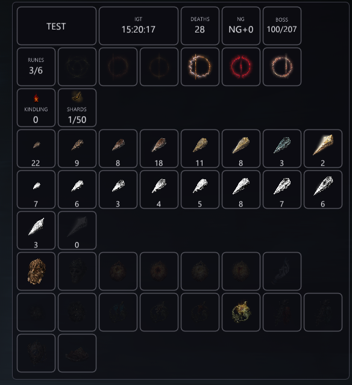
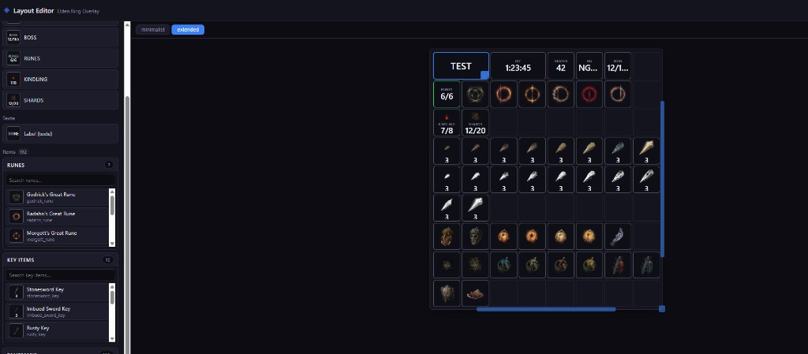

# Elden Ring Overlay (offline, read-only)

A Rust overlay injected into an **already-running** `eldenring.exe`, **read-only**. Shows a customizable dashboard: IGT, a **boss** counter, Great Runes, deaths, NG+, Key items...



> **Read-only, offline, no cheating.** No memory writes, no anti-cheat bypass. Single-player, offline use only.

> **Note on development.** This project was developed largely with the assistance of an LLM (code generation, refactoring, documentation). The code is reviewed and tested, but keep this in mind when reviewing or reusing it.

---

## Table of contents

**User guide**
- [Warnings](#warnings)
- [Installation](#installation)
- [Running the overlay](#running-the-overlay)
- [Configuration (`er_overlay.toml`)](#configuration-er_overlaytoml)
- [Customizing the display](#customizing-the-display)
- [Layout editor](#layout-editor)
- [Troubleshooting](#troubleshooting)

**Technical reference**
- [Architecture](#architecture)
- [Layout format (reference)](#layout-format-reference)
- [Available metrics](#available-metrics)
- [Game data (tables)](#game-data-tables)
- [Icons](#icons)
- [Development](#development)
- [References](#references)

---

# User guide

## Warnings

- **Offline only** — no multiplayer / online support.
- **Does not bypass EAC** — launch the game without EasyAntiCheat (e.g. run `eldenring.exe` directly with `steam_appid.txt`).
- **Read-only** — no memory writes, this is not a trainer.
- **Transparent, documented injection** (`LoadLibraryW` via `CreateRemoteThread`), no stealth.

## Installation

### Requirements

- Windows **x64**
- An Elden Ring version supported by [fromsoftware-rs](https://github.com/vswarte/fromsoftware-rs) (`eldenring` 0.14, e.g. 2.6.x)
- Rust **1.85+** (only needed to build it yourself)

### Build

```powershell
cd Overlay
cargo build --release
```

Artifacts in `target/release/`:

- `er_overlay_injector.exe` — the injector
- `er_overlay.dll` — the overlay itself

The build copies `er_overlay.toml`, `layouts/`, `tables/<lang>/bosses.toml` and `assets/icons/` next to the binaries.

## Running the overlay

1. Launch Elden Ring **offline** (EAC disabled).
2. Make sure `er_overlay.dll`, `er_overlay_injector.exe`, `er_overlay.toml`, `layouts/` and `tables/` are **in the same folder**.
3. **Double-click `er_overlay_injector.exe`.** That's it — the overlay appears in-game.

The injector finds `eldenring.exe` automatically, checks it's x64, warns if EAC modules are detected, then injects.

If something goes wrong, check the logs: `logs/er_injector.log` and `logs/er_overlay.log`.

### Advanced (command line)

For specific cases you can run the injector from a terminal with flags:

```powershell
# target a specific process id
.\er_overlay_injector.exe --pid 12345
# explicit DLL path
.\er_overlay_injector.exe --dll ".\er_overlay.dll"
# validate everything without injecting
.\er_overlay_injector.exe --dry-run
```

## Configuration (`er_overlay.toml`)

Read next to the DLL, **hot-reloaded every 2 seconds** (you can edit it while the game runs). Out-of-range values are clamped to their default with a warning in the log.

| Option | Type | Default | Description |
|--------|------|---------|-------------|
| `layout_file` | path | `layouts/dashboard.toml` | Layout file to display (see [Customizing the display](#customizing-the-display)). |
| `default_layout_section` | string | — | Section shown at startup (overrides the layout's own `default_section`). |
| `layout_section_hotkey` | string | — | Key to cycle through sections, e.g. `"F8"`, `"Ctrl+Shift+F1"`. |
| `anchor` | enum | `top-right` | Anchor corner: `top-left`, `top-right`, `bottom-left`, `bottom-right`. |
| `offset_x`, `offset_y` | px | `16`, `16` | Offset from the anchor corner. |
| `scale` | 0–4 | `1.0` | Global overlay scale. |
| `text_size` | px (≤72) | `18` | Base font size. |
| `icon_size` | px (≤128) | `24` | Reference icon size. |
| `background_opacity` | 0–1 | `0.65` | Window background opacity. |
| `gray_tint` | 0–1 | `0.40` | Tint of **unowned** items (lower = darker). |
| `use_item_icons` | bool | `true` | `true` = real PNG icons when present, otherwise colored dots. |
| `icons_dir` | path | `assets/icons` | PNG folder (relative to the DLL). |
| `show_debug` | bool | `false` | Shows a diagnostics window (backend, resolved pointers, loaded flags). |
| `boss_panel_hotkey` | string | `F7` | Toggle the boss checklist panel. |
| `boss_panel_scope` | enum | `current-region` | `current-region` or `all-regions`. |
| `boss_panel_visible` | bool | `true` | Show the boss panel at startup. |
| `boss_panel_layout` | string | — | Panel `x,y,width,height` (pixels or `%`). Omit or `auto` = `"-5, 10, 25%, 92%"` (right-aligned), shifted below the minimalist HUD. Negative x/y = offset from right/bottom edge. |
| `boss_locale` | string | `auto` | Boss table language (`en`, `fr`, …). `auto` reads the game language via Steam; falls back to `en`. |

## Customizing the display

What gets shown is driven entirely by the **layout file** (`layout_file`), not by the code. A layout is a **grid** of tiles; each tile occupies one or more cells.

Three tile kinds:

| Kind | Shows |
|------|-------|
| `metric` | A counter or time: IGT, deaths, NG+, bosses killed, group progress, item quantity. |
| `item` | A tracked item (icon **in color** if owned, **greyed out** otherwise; quantity for consumables). Optional `track_equipped = true` adds a **green border** while the item is equipped. |
| `label` | Plain decorative text (heading, separator). |

### Sections

A layout can contain multiple **sections**; only one is visible at a time. Switch between them with `layout_section_hotkey`. Handy for keeping a "minimalist" view and a "full" view on the same key.

Two ways to write a layout:

- **Simple layout**: a flat list of `[[tile]]` entries (forms a single `"default"` section).
- **Multi-section layout**: `[[section]]` blocks (each with a `name`) containing `[[section.tile]]` entries.

The full syntax is in [Layout format](#layout-format-reference). An invalid layout (overlapping tiles, grid overflow, empty section…) is **rejected on load** and reported in the log.

Provided layout: `layouts/dashboard.toml` (two sections: `minimalist` and `extended`).

## Layout editor

Instead of writing TOML by hand, use the **visual editor** in `tools/layout_editor/`.



1. Open `tools/layout_editor/layout_editor.html` in a browser.
   *(If file import/export is blocked by the browser, serve the folder: `python -m http.server` from `tools/layout_editor/`, then open `http://localhost:8000/layout_editor.html`.)*
2. **Drag** items from the palette (metrics, text, items) onto the grid.
3. Adjust the grid (columns, rows, unit size, gap) and each tile's properties in the right-hand panel (item tiles: optional **track_equipped** checkbox for equipped highlight).
4. Click **Export TOML**.
5. Put the exported file in `layouts/` and point `layout_file` at it in `er_overlay.toml`.

The item palette is generated from `goods.toml`; if you add items to that table, regenerate it (see `tools/layout_editor/layout_editor_assets/README.md`).

## Troubleshooting

| Problem | Hint |
|---------|------|
| Injector: "process not found" | Launch Elden Ring first. |
| Injection fails | EAC is active → run the game offline; try running the injector as administrator. |
| "LoadLibraryW returned NULL" | DLL missing / missing dependency / wrong architecture — check the DLL path. |
| All values show `---` | Game version unsupported by fromsoftware-rs; enable debug logs. |
| No icons (only dots) | PNGs missing from `assets/icons` — see [Icons](#icons). |
| Overlay crash | Conflict with another DX12 hook (RTSS, etc.). |

---

# Technical reference

## Architecture

A Cargo workspace of 5 crates:

| Crate | Role |
|-------|------|
| `er_overlay_common` | TOML config, layout format, hotkeys, logging, shared types. |
| `er_game_state` | Game reads via **fromsoftware-rs** (`GameDataMan`, `CSEventFlagMan`, `WorldChrMan`) + data tables. `GameStateSource` trait (live impl + testable mock). |
| `er_overlay_ui` | View model + ImGui rendering (tiles, icons, text). |
| `er_overlay_dll` | Injected DLL, DX12 hook via [hudhook](https://github.com/veeenu/hudhook). |
| `er_overlay_injector` | Documented `LoadLibraryW` injector. |

Loop: `er_overlay_dll` polls `er_game_state` (throttled to ~250 ms), builds an `OverlayViewModel`, and `er_overlay_ui` renders it according to the active layout.

## Layout format (reference)

```toml
[grid]
columns = 8          # max placement width (validation)
unit_size = 64       # side of one square cell, in px
gap = 4              # spacing between cells
border_radius = 6
window_padding = 8

[style]
border_default  = [100, 100, 110, 200]  # RGBA
border_complete = [60, 200, 90, 255]     # border when a metric is "complete"
tile_bg         = [12, 12, 18, 180]
label_scale = 0.65   # label size relative to text
value_scale = 1.15   # value size relative to text

default_section = "minimalist"   # optional
```

Then either a flat list of tiles:

```toml
[[tile]]
kind = "metric"
metric = "igt"
col = 0
row = 0
w = 2       # alias of col_span
h = 1       # alias of row_span
label = "IGT"
```

…or sections:

```toml
[[section]]
name = "minimalist"

[[section.tile]]
kind = "label"
col = 0
row = 0
w = 2
h = 1
label = "RUN"
```

**Fields per tile kind** (all: `col`, `row`, `w`/`col_span`, `h`/`row_span`, optional `id`):

- `metric`: `metric` (metric id), `label`, `show_max` (bool, shows `N/total`), `icon` (optional PNG key shown above the text).
- `item`: `key` (a good key from `goods.toml`). Colored icon if owned, greyed out otherwise, quantity for consumables. Optional `track_equipped = true` adds a green border highlight while the item is equipped (talismans, great runes, quick-slot consumables).
- `label`: `label` (text).

**Validation rules**: `columns > 0`, spans `> 0`, no overlapping tiles *within the same section*, `col + col_span ≤ columns`, unique and non-empty section names, non-empty sections. The file is re-validated on every reload (every 2 s).

## Available metrics

The `metric` field of a `metric` tile accepts:

| Metric | Meaning |
|--------|---------|
| `igt` | In-game time (`HH:MM:SS`). |
| `deaths` | Death count. |
| `ng_cycle` | New Game cycle (`NG+N`). |
| `bosses` | Bosses killed out of 207. |
| `scadutree_blessing` | Scadutree Blessing level spent at Sites of Grace (`N/20`). Distinct from the `scadutree` good key (fragment inventory count). |
| *group name* | `owned/total` progress of an aggregate group from `goods.toml` (e.g. `great_runes`). |
| *good key* | Quantity (consumable `count = true`) or `0/1` owned state for a unique item. |

Any unknown key renders `---` (unavailable).

## Game data (tables)

### Bosses — `tables/<lang>/bosses.toml`

One complete boss table per language (`tables/en/bosses.toml`, `tables/fr/bosses.toml`, …): 207 entries (165 base + 42 Shadow of the Erdtree), regions, display order, flags, icons. Copied next to the DLL at build time. **Hot-reloaded** when the file changes (same 2 s poll as `er_overlay.toml`); if the locale file is missing, falls back to `tables/en/bosses.toml` (embedded in the DLL). Set `boss_locale = "auto"` to match the in-game language, or override with `fr`. Regenerate a locale with `python tools/gen_boss_locale_toml.py fr` (from `en/bosses.toml` + ER_boss_checklist_R JSON).

### Goods — `crates/er_game_state/tables/goods.toml`

One `[[good]]` row per tracked item. Fields:

| Field | Required | Description |
|-------|:--------:|-------------|
| `key` | yes | Unique id (and default PNG name `{key}.png`). |
| `item_id` | yes | The item's `param_id` (`EquipParamGoods` or `EquipParamAccessory`). |
| `name` | — | Display name. |
| `category` | — | `goods` (default) or `accessory` (talismans). Avoids `param_id` collisions between categories. |
| `count` | — | `true` = stackable consumable → shows the inventory quantity. |
| `max` | — | Display cap for a counter (e.g. scadutree → `N/50`). |
| `pickup_flag` | — | Ownership event flag (fallback when the item is no longer in inventory). |
| `file` | — | Custom PNG name. |
| `icon_id` | — | Used only by the icon-fetching scripts. |

**Aggregate groups**: declared via a `[groups.<name>]` table listing `members` (good keys). The overlay then exposes a `<name>` metric = number of owned members / total. Example:

```toml
[groups.great_runes]
members = ["godrick_rune", "radahn_rune", "morgott_rune", "rykard_rune", "mohg_rune", "malenia_rune"]
```

Talismans (category `accessory`) live in a delimited block (`# --- talismans ---` … `# --- end talismans ---`).

## Icons

Tiles can display real in-game icons (PNG) instead of colored dots.

Place PNG files in `assets/icons/`, one per good, named after its `key` (e.g. `godrick_rune.png`) or the good's `file` field. Keep `use_item_icons = true` (default) in `er_overlay.toml`. Any missing icon falls back to a colored dot.

PNGs are **gitignored** (`assets/icons/*.png`). When deploying, copy `assets/icons/` next to `er_overlay.dll`.

## Development

```powershell
cargo test --workspace      # tests
cargo clippy --workspace    # lints
cargo fmt --all             # formatting
```

CI (`.github/workflows/ci.yml`) runs `fmt --check`, `clippy -D warnings` and `test` on every push/PR.

`er_game_state` exposes a `mock` feature (`MockGameState`) for testing the UI without the game.

## References

- [hudhook](https://github.com/veeenu/hudhook) — DX12 + ImGui hook
- [fromsoftware-rs](https://github.com/vswarte/fromsoftware-rs) — game structure access
- [SoulSplitter](https://github.com/FrankvdStam/SoulSplitter) — flags / IGT reference
- [SmithBox](https://github.com/vawser/Smithbox) - icons / flags

## License

**GNU Affero General Public License v3.0 (AGPL-3.0-only)** — see [`LICENSE`](LICENSE).

This is a **strong copyleft** license. In short: anyone who distributes this software, a modified version, or a derivative work — **including merely making it available over a network** — must release the complete corresponding source code under the same AGPL-3.0 license. In other words: if you reuse this code, your project must stay open source.
