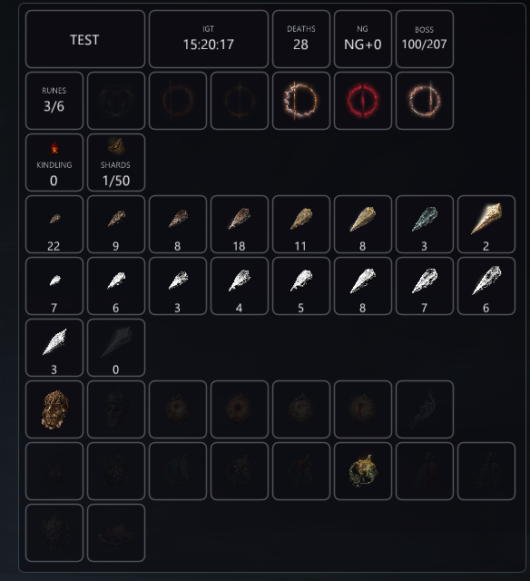
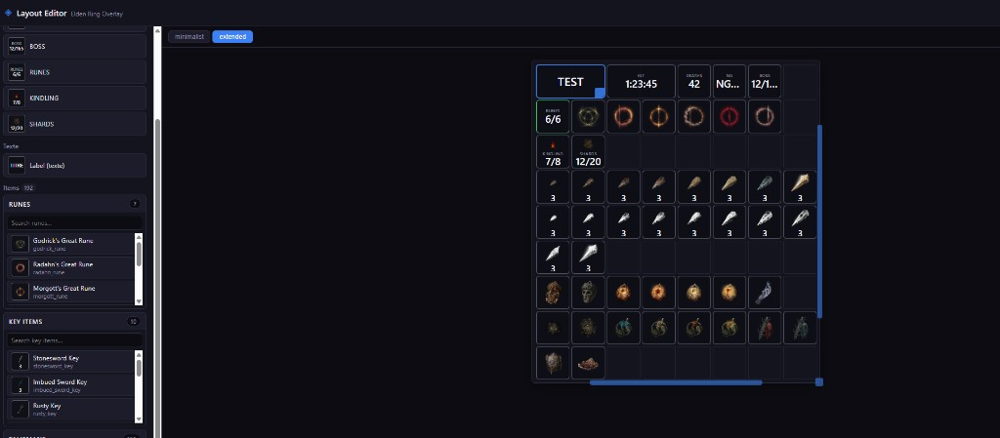

# Elden Ring Overlay (offline, read-only)

A Rust overlay injected into an **already-running** `eldenring.exe`, **read-only**. It shows a customizable dashboard — IGT, a **boss** counter, Great Runes, deaths, NG+, key items — plus **boss/loot checklists** with item-randomizer support.



> **Read-only, offline, no cheating.** No memory writes, no anti-cheat bypass. Single-player, offline use only.

> **Note on development.** This project was developed largely with the assistance of an LLM (code generation, refactoring, documentation). The code is reviewed and tested, but keep this in mind when reviewing or reusing it.

> 🇫🇷 Une version française de ce document est disponible : [README.fr.md](README.fr.md).

---

## Table of contents

**User guide**
- [Quick start](#quick-start)
- [Warnings](#warnings)
- [Installation](#installation)
- [Configuration (`er_overlay.toml`)](#configuration-er_overlaytoml)
- [The dashboard: tiles, tracking modes and metrics](#the-dashboard-tiles-tracking-modes-and-metrics)
- [Checks panel (randomizer-aware)](#checks-panel-randomizer-aware)
- [Challenge mode](#challenge-mode)
- [Layout editor](#layout-editor)
- [Troubleshooting](#troubleshooting)

**Technical reference**
- [Architecture](#architecture)
- [Layout format (reference)](#layout-format-reference)
- [Available metrics (reference)](#available-metrics-reference)
- [Game data (tables)](#game-data-tables)
- [Icons](#icons)
- [Development](#development)
- [References](#references)
- [License](#license)

---

# User guide

## Quick start

**You don't need to compile anything.** Download a pre-built zip from [GitHub Releases](https://github.com/Sully-/ER_DynamicOverlay/releases) (`er-overlay-vX.X.X.zip`), extract it anywhere, and follow the four steps below.

### 1. Launch Elden Ring offline

The overlay **does not work with EasyAntiCheat enabled**. Start the game in offline mode, for example:

- Launch `eldenring.exe` directly (not through the EAC launcher), with a `steam_appid.txt` containing `1245620` next to the exe, **or**
- Use your usual offline / no-EAC method.

Keep the game running on the title screen or in a save — the injector attaches to an already-running process.

### 2. Run the overlay

After extracting the zip you get a single folder. Keep everything together — **do not separate these files:**

| File / folder | Role |
|---------------|------|
| `er_overlay_injector.exe` | Launcher — **double-click this** |
| `er_overlay.dll` | Overlay (injected into the game) |
| `er_overlay.toml` | Settings (position, scale, hotkeys, layout file…) |
| `layouts/` | Dashboard layout files |
| `tables/` | Boss / checks lists per language |
| `assets/` | Item icons |
| `companion/er_checks_extractor.exe` | Helper that reads a randomizer `regulation.bin` (see [Checks panel](#checks-panel-randomizer-aware)) |
| `layout_editor.html` | Visual layout editor (see [Layout editor](#layout-editor)) |
| `challenge_state.toml` | *(runtime)* Challenge PB / tries — created when `[challenge] enabled = true` |
| `checks_flags.toml` | *(runtime)* Per-seed randomizer flags — created only when `regulation_path` is set |

With Elden Ring already running offline, **double-click `er_overlay_injector.exe`**. The overlay appears in-game (default: top-right HUD only). Re-run the injector after each game restart — it is not persistent across launches.

**Default hotkeys** (defined in `er_overlay.toml`, hot-reloaded every 2 s):

| Key | Action |
|-----|--------|
| `F8` | Switch layout section (`minimalist` → `extended` → `challenge`, …) |
| `F7` | Toggle the boss checklist panel |
| `F6` | Toggle the checks panel (boss + loot checklist, randomizer-aware) |
| `F9` | Show / hide the entire overlay |

The **boss panel**, the **checks panel** and the **extended** layout section are mutually exclusive: opening one closes the others.

If something goes wrong, check `logs/er_injector.log` and `logs/er_overlay.log` in the same folder.

### 3. Customize your dashboard

Everything shown is driven by a **layout file** — a grid of tiles. Edit it visually with the bundled **`layout_editor.html`** (no TOML to learn), then point `layout_file` at your file in `er_overlay.toml`. See [Layout editor](#layout-editor) for the workflow and [The dashboard](#the-dashboard-tiles-tracking-modes-and-metrics) for what each tile does.

### 4. Tweak appearance and behavior

Open `er_overlay.toml` in any text editor (hot-reloaded ~every 2 s). The most common options are `anchor` / `offset_x` / `offset_y` (position), `icon_size` (icon size), and the panel toggles. `scale` / `text_size` remain as fallbacks when the layout omits them. See [Configuration](#configuration-er_overlaytoml) for the full reference.

## Warnings

- **Offline only** — no multiplayer / online support.
- **Does not bypass EAC** — launch the game without EasyAntiCheat (e.g. run `eldenring.exe` directly with `steam_appid.txt`).
- **Read-only** — no memory writes, this is not a trainer.
- **Transparent, documented injection** (`LoadLibraryW` via `CreateRemoteThread`), no stealth.

## Installation

### From a GitHub release (recommended)

See **[Quick start](#quick-start)** above. Requirements:

- Windows **x64**
- Elden Ring **offline**, a version supported by the release (currently **2.6.2.0 (WW)** and **2.6.2.1 (JP)** — see [Troubleshooting](#troubleshooting) if values show `---`)

### Build from source

For developers who want to compile locally:

- Windows **x64**
- An Elden Ring version supported by [fromsoftware-rs](https://github.com/vswarte/fromsoftware-rs) (`eldenring` 0.14, e.g. 2.6.x)
- Rust **1.85+**

```powershell
cd Overlay
cargo build --release
```

Artifacts land in `target/release/`: `er_overlay_injector.exe` (the injector) and `er_overlay.dll` (the overlay). The build also copies `er_overlay.toml`, `layouts/`, `tables/<lang>/bosses.toml`, `tables/<lang>/checks.toml` and `assets/icons/` next to the binaries. To produce a release-style zip locally (including the randomizer helper): `.\tools\bundle_release.ps1`.

The randomizer helper (`companion/er_checks_extractor`) is a separate .NET project, published self-contained:

```powershell
git submodule update --init companion/SoulsFormatsNEXT
dotnet publish companion/er_checks_extractor/er_checks_extractor.csproj -c Release
```

The release bundle publishes it to `companion/er_checks_extractor.exe` next to the DLL automatically (or point `checks_extractor_path` at a custom build).

### Advanced injector (command line)

For specific cases you can run the injector from a terminal with flags:

```powershell
# target a specific process id
.\er_overlay_injector.exe --pid 12345
# explicit DLL path
.\er_overlay_injector.exe --dll ".\er_overlay.dll"
# validate everything without injecting
.\er_overlay_injector.exe --dry-run
```

## Configuration (`er_overlay.toml`)

Read next to the DLL and **hot-reloaded every 2 seconds** — you can edit it while the game runs. Out-of-range values are clamped to their default with a warning in the log.

### Appearance & position

| Option | Type | Default | Description |
|--------|------|---------|-------------|
| `layout_file` | path | `layouts/dashboard.toml` | Layout file to display (see [The dashboard](#the-dashboard-tiles-tracking-modes-and-metrics)). |
| `default_layout_section` | string | — | Section shown at startup (overrides the layout's own `default_section`). |
| `anchor` | enum | `top-right` | Anchor corner: `top-left`, `top-right`, `bottom-left`, `bottom-right`. |
| `offset_x`, `offset_y` | px | `16`, `16` | Offset from the anchor corner. |
| `scale` | 0–4 | `1.0` | Fallback HUD scale when the layout omits `[style].scale`. |
| `text_size` | px (≤72) | `18` | Fallback base font size when the layout omits `[style].text_size`. |
| `icon_size` | px (≤128) | `24` | Reference icon size. |
| `background_opacity` | 0–1 | `0.65` | Window background opacity. |
| `gray_tint` | 0–1 | `0.40` | Tint of **unowned** items (lower = darker). |
| `use_item_icons` | bool | `true` | `true` = real PNG icons when present, otherwise colored dots. |
| `icons_dir` | path | `assets/icons` | PNG folder (relative to the DLL). |
| `show_debug` | bool | `false` | Shows a diagnostics window (backend, resolved pointers, loaded flags). |

### Hotkeys

| Option | Type | Default | Description |
|--------|------|---------|-------------|
| `layout_section_hotkey` | string | `F8` | Cycle through layout sections, e.g. `"F8"`, `"Ctrl+Shift+F1"`. |
| `boss_panel_hotkey` | string | `F7` | Toggle the boss checklist panel. |
| `checks_panel_hotkey` | string | `F6` | Toggle the checks panel (boss + loot checklist). |
| `hide_all_hotkey` | string | `F9` | Show / hide the entire overlay. |

### Boss & checks panels

| Option | Type | Default | Description |
|--------|------|---------|-------------|
| `boss_panel_visible` | bool | `true`* | Show the boss panel at startup. At most one of boss / checks shows at startup; boss wins if both are `true`. |
| `boss_panel_scope` | enum | `current-region` | `current-region` or `all-regions`. |
| `boss_panel_layout` | string | — | Panel `x,y,width,height` (pixels or `%`). Omit or `auto` = `"-5, 10, 25%, 92%"` (right-aligned), shifted below the minimalist HUD. Negative x/y = offset from right/bottom edge. |
| `boss_locale` | string | `auto` | Boss table language (`en`, `fr`, …). `auto` reads the game language via Steam; falls back to `en`. |
| `checks_panel_visible` | bool | `false` | Show the checks panel at startup. Mutually exclusive with the boss panel (boss wins if both are `true`). |
| `checks_panel_scope` | enum | `current-region`* | `current-region` or `all-regions`. |
| `checks_panel_layout` | string | — | Panel `x,y,width,height` (pixels or `%`). Omit or `auto` = `"5, 10, 25%, 92%"` (left-aligned, mirrors the boss panel). |
| `regulation_path` | path | — | Path to the `regulation.bin` the game **loads** (your randomizer / ModEngine mod). Enables per-seed resolution of randomized loot flags. Empty/omitted = vanilla flags. See [Checks panel](#checks-panel-randomizer-aware). |
| `checks_extractor_path` | path | — | Override the helper exe location. Omit to auto-find `companion/er_checks_extractor.exe` (then `er_checks_extractor.exe`) next to the DLL. |

\* The bundled `er_overlay.toml` ships `boss_panel_visible = false` and `checks_panel_scope = all-regions`.

### `[challenge]` block

The optional challenge ruleset (PB / failed runs) is configured under `[challenge]`. See **[Challenge mode](#challenge-mode)** for the full block, semantics and layout tiles.

## The dashboard: tiles, tracking modes and metrics

Everything on screen is driven by the **layout file** (`layout_file`), not by the code. A layout is a **grid** of tiles; each tile occupies one or more cells. Edit it with the [Layout editor](#layout-editor) or by hand (see [Layout format](#layout-format-reference)).

### Tile kinds

| Kind | Shows |
|------|-------|
| `metric` | A counter or time: IGT, deaths, NG+, bosses killed, challenge **PB** / **TRIES**, group progress, item quantity. See [Available metrics](#available-metrics-reference). |
| `item` | A single tracked item, with one or more **tracking modes** (below). |
| `label` | Plain decorative text (heading, separator). |

### Item tracking modes

An `item` tile can track up to three **independent** aspects of an item. You can combine them on the same tile (e.g. a talisman that highlights when equipped *and* stays lit once acquired).

| Mode | Enable with | What it does |
|------|-------------|--------------|
| **Owned** (default) | *(always on)* | Icon **in color** when the item is currently in your inventory (or its pickup flag is set), **greyed out** otherwise. Consumables (`count = true`) show their quantity instead. |
| **Equipped** | `track_equipped = true` | Adds a **green border** while the item is **currently equipped** — talismans, Great Runes, quick-slot consumables, pouch. Ideal for seeing your active loadout at a glance. |
| **Historic** | `historic = true` | Keeps the item marked as owned **even after you no longer hold it** (consumed, sold, discarded). Instead of only reading your current inventory, it also checks the item's **acquisition flag**, so "did I ever pick this up?" stays true. **Randomizer-aware:** it resolves the seed-specific flag from the item's lot metadata when `regulation_path` is set. |

**Why they matter**

- **Equipped** answers *"is this talisman/rune slotted right now?"* — great for build/loadout HUDs.
- **Historic** answers *"have I obtained this at least once this run?"* — essential for one-time or consumable items (e.g. scarseals/soreseals, scorpion charms) that you might swap out, so the tile doesn't go dark the moment the item leaves your inventory.

Example tile combining both:

```toml
[[section.tile]]
kind = "item"
key = "fire_scorpion_charm"
track_equipped = true   # green border while worn
historic = true         # stays lit once obtained
col = 0
row = 0
```

### Sections

A layout can contain multiple **sections**; only one is visible at a time. Switch between them with `layout_section_hotkey` (`F8` by default) — handy for keeping a "minimalist" and a "full" view on the same key.

The bundled `layouts/dashboard.toml` ships three sections: `minimalist`, `extended`, and `challenge` (with `pb` / `nbtries`). An invalid layout (overlapping tiles, grid overflow, empty section…) is **rejected on load** and reported in the log.

## Checks panel (randomizer-aware)

The **checks panel** is a single checklist of everything worth completing in a run. A *check* is one thing to do: a **boss to kill** or an **important item to grab**. Think of it as the boss panel, but it also lists key loot — and it can follow the **item randomizer**.

### How to use it (the basics)

1. Start Elden Ring and run the overlay (see [Quick start](#quick-start)).
2. Press **`F6`** to open or close the panel.
3. Play normally. Each line ticks itself off the moment you kill the boss or pick up the item — you don't click anything.

What you see:

- Checks are **grouped by region** (Limgrave, Liurnia, …), so you can see what's left where you are.
- A check you've completed is **ticked / highlighted**; one you haven't is dim.
- Hover a line to see a **location hint** (where to find it).
- By default the panel shows the **region you're currently in**. To list every region at once, set `checks_panel_scope = "all-regions"` in `er_overlay.toml`.

That's all most people need. The rest of this section is **only for randomizer players**.

### Vanilla (no mods): nothing to do

If you play normal Elden Ring, you're done — the checklist is built in and works out of the box. Leave `regulation_path` empty in `er_overlay.toml` and just press `F6`.

### With the item randomizer (thefifthmatt, [Nexus #428](https://www.nexusmods.com/eldenring/mods/428))

The randomizer **shuffles where items are**, so a given spot on the ground holds a different item every seed. To tick those off correctly, the overlay has to read the **same `regulation.bin` your game is actually loading** (the modded one, not the vanilla game file).

Do this once per setup:

1. **Find your modded `regulation.bin`.** It's the file the randomizer generated for your seed — usually inside the mod folder you launch the game with, for example:
   - ModEngine 2: `…\ModEngine2\mod\regulation.bin`
   - Randomizer output folder: wherever you told the randomizer to write, next to its other files.

   If you're not sure, it's the `regulation.bin` your launch profile / ModEngine config points at — **not** the one in your Steam `Game\` install.

2. **Tell the overlay where it is.** Open `er_overlay.toml` and set `regulation_path` to that full path. Use **single quotes** so you don't have to double your backslashes:

```toml
regulation_path = 'C:\Games\ModEngine2\mod\regulation.bin'
```

3. **Save the file.** Within ~2 seconds the overlay reads the modded regulation on its own (via the bundled `companion/er_checks_extractor.exe`) and starts tracking the right items for your seed.

4. **Check it worked:** the panel header shows a **`[seed]`** tag when the seed mapping is active. No tag = it didn't load (see below).

You only do this once. When you **change seed**, just point `regulation_path` at the new `regulation.bin` (or replace the file at the same path) and save — the overlay re-reads it automatically. You never run the helper by hand.

**If the `[seed]` tag doesn't appear:**

- Double-check the path is the **modded** `regulation.bin` and that the file exists (typos, wrong folder).
- Make sure `companion/er_checks_extractor.exe` is present next to `er_overlay.dll` (don't move files out of the extracted folder).
- Look at `logs/er_overlay.log` — it logs whether the extractor ran and wrote `checks_flags.toml`.

**Good to know**

- Bosses and chest loot use fixed flags, so they tick off the same with or without the randomizer. Only **ground loot** needs the seed step above.
- If your seed puts an item with **no tracking flag** on a randomized spot, that line is greyed out and labelled **"Untraceable this seed"**. This is normal, not a bug — the game simply gives the overlay nothing to watch for that pickup.
- To go back to vanilla tracking, empty or remove `regulation_path` and save.

## Challenge mode

Track a **personal best** (most bosses killed on a run within your death budget) and how many times the run **failed**, without editing game saves. Inspired by the boss challenge mode of [EROverlay](https://github.com/soarqin/EROverlay). **Disabled by default.**

### Configuration (`[challenge]`)

| Option | Type | Default | Description |
|--------|------|---------|-------------|
| `enabled` | bool | `false` | When `false`, challenge metrics show `---` and no progress is tracked. |
| `max_deaths` | u32 | `0` | Deaths allowed **per run** (inclusive). The run fails when run deaths exceed this value. `0` = deathless. |
| `start_flag` | u32 | `101` | Event flag that marks the **start of a run** (flag `101` = left the Cave of Knowledge / Stranded Graveyard, same as EROverlay). |

```toml
[challenge]
enabled = true
max_deaths = 0      # deathless: one death ends the run
start_flag = 101
```

### Metrics

Add these as `kind = "metric"` tiles (the bundled `layouts/dashboard.toml` includes a **`challenge`** section with both):

| Metric | Label idea | Meaning |
|--------|------------|---------|
| `pb` | PB | Highest boss kill count recorded while the current run is still within the death budget. |
| `nbtries` | TRIES | Number of failed runs (increments once when deaths exceed `max_deaths`, not once per extra death). |

When `[challenge].enabled = false`, both show `---`.

### Typical deathless run (`max_deaths = 0`)

| Event | PB | TRIES |
|-------|-----|-------|
| Kill 1 boss, no deaths | 1 | 0 |
| First death (run failed) | 1 (frozen) | 1 |
| Kill another boss on the same save | 1 | 1 |

After a failed run, PB stays frozen until you start a **new game** (flag `101` clears with zero deaths on the character). You can keep playing on the same save; the overlay just stops counting a new PB for that failed run.

### Enabling in-game

1. Set `enabled = true` under `[challenge]` in `er_overlay.toml` (hot-reloaded ~every 2 s).
2. Press **`F8`** until the **`challenge`** layout section is visible, or add `pb` / `nbtries` tiles to your own layout.
3. Leave the tutorial cave — run tracking starts when flag `101` becomes active.

**Notes**

- **Progress file:** `challenge_state.toml` (next to `er_overlay.dll`, created at runtime) stores personal best (`pb`), failed run count (`nbtries` / `tries`), and internal run state. Delete it to reset PB and tries.
- Boss count uses the same 207-boss table as the main `bosses` metric (save-wide kill flags).
- Challenge updates are paused during loading screens / when in-game time is not running (same idea as EROverlay), so respawn fades do not corrupt run state.
- Compatible with `boss_panel_scope` and the rest of the HUD; challenge is independent of the boss checklist panel.

## Layout editor

The release zip includes a **visual editor** — no TOML syntax to learn. It ships as **`layout_editor.html`** at the root (with `layout_editor_assets/`); when building from source the same files live under `tools/layout_editor/`.



1. Open **`layout_editor.html`** from the extracted folder in your browser (Chrome, Edge, Firefox…).
   - If import/export is blocked, serve the folder instead: open a terminal in the folder and run `python -m http.server`, then go to `http://localhost:8000/layout_editor.html`.
2. **Drag** metrics, labels, and items from the left palette onto the grid.
3. Tune the grid (columns, rows, cell size, gap) and each tile in the right panel — including the `track_equipped` and `historic` toggles for item tiles (see [Item tracking modes](#item-tracking-modes)).
4. Use **Import layout file** to edit the bundled `layouts/dashboard.toml`, or start from **New**.
5. Click **Export layout file** and save the `.toml` into the `layouts/` folder (e.g. `layouts/my_run.toml`).
6. Edit `er_overlay.toml` and set `layout_file = "layouts/my_run.toml"`. The overlay reloads the file automatically within ~2 seconds (even while the game is running).

**Tip:** create multiple **sections** in one file (e.g. a compact view and a full view) and switch between them with `F8`.

**Developers:** the item palette is generated from `goods.toml`; after edits run `python tools/goods/gen_catalog.py` (see [Goods toolkit](tools/goods/README.md)).

## Troubleshooting

| Problem | Hint |
|---------|------|
| Injector: "process not found" | Launch Elden Ring first. |
| Injection fails | EAC is active → run the game offline; try running the injector as administrator. |
| "LoadLibraryW returned NULL" | DLL missing / missing dependency / wrong architecture — check the DLL path. |
| All values show `---` | Game version unsupported — check `logs/er_overlay.log` for `Unsupported game executable` or set `show_debug = true`. Supported builds: **2.6.2.0 (WW), 2.6.2.1 (JP)** (`eldenring` 0.14). |
| Game crashes on inject | Check `logs/er_overlay.log`: last line before crash pinpoints the step (`Hudhook::apply`, `build_view_model`, etc.). Update the game if the log says unsupported executable. |
| No icons (only dots) | PNGs missing from `assets/icons` — see [Icons](#icons). |
| Overlay crash | Conflict with another DX12 hook (RTSS, etc.). |
| Item tile never lights up | Wrong `key`, or the item leaves your inventory — add `historic = true` to keep it lit after acquisition (see [Item tracking modes](#item-tracking-modes)). |
| Equipped highlight never shows | `track_equipped = true` only lights up while the item is actually equipped (talismans, runes, quick slots, pouch). |
| Challenge metrics always `---` | Set `[challenge] enabled = true` in `er_overlay.toml`. |
| PB / tries look wrong after testing | Delete `challenge_state.toml` next to the DLL and retry on a clean run. |
| Randomized ground loot not tracked | Set `regulation_path` to the `regulation.bin` the game loads; check `logs/er_overlay.log` for the extractor result and that `checks_flags.toml` was written. |
| Checks header has no `[seed]` tag | No seed mapping active — `regulation_path` is unset/wrong, or `er_checks_extractor.exe` is missing next to the DLL. |

### Logs and diagnostics

All runtime output goes to **`logs/`** next to `er_overlay.dll`:

| File | Contents |
|------|----------|
| `er_overlay.log` | DLL init, game version probe, Hudhook, pointer resolution, errors |
| `er_injector.log` | Process lookup, EAC warning, injection result |

Enable **`show_debug = true`** in `er_overlay.toml` for an in-game window (backend, game exe version, resolved pointers). For verbose logging, set env `RUST_LOG=debug` before launching the injector. Supported game builds are logged at startup (`Game executable supported` vs `Unsupported game executable`).

---

# Technical reference

## Architecture

A Cargo workspace of 5 crates:

| Crate | Role |
|-------|------|
| `er_overlay_common` | TOML config, layout format, hotkeys, logging, shared types. |
| `er_game_state` | Game reads via **fromsoftware-rs** (`GameDataMan`, `CSEventFlagMan`, `WorldChrMan`) + data tables. `GameStateSource` trait (live impl + testable mock). |
| `er_overlay_ui` | View model + ImGui rendering (tiles, icons, text). |
| `er_overlay_dll` | Injected DLL, DX12 hook via [hudhook](https://github.com/veeenu/hudhook). |
| `er_overlay_injector` | Documented `LoadLibraryW` injector. |

Loop: `er_overlay_dll` polls `er_game_state` (throttled to ~250 ms), builds an `OverlayViewModel`, and `er_overlay_ui` renders it according to the active layout.

## Layout format (reference)

```toml
[grid]
columns = 8          # max placement width (validation)
unit_size = 64       # side of one square cell, in px
gap = 4              # spacing between cells
border_radius = 6
window_padding = 8

[style]
border_default  = [100, 100, 110, 200]  # RGBA
border_complete = [60, 200, 90, 255]     # border when a metric is "complete" / an item is equipped
tile_bg         = [12, 12, 18, 180]
text_size = 18       # base font size (else er_overlay.toml)
scale = 1.0          # HUD scale (else er_overlay.toml)
label_scale = 0.65   # label size relative to text
value_scale = 1.15   # value size relative to text

default_section = "minimalist"   # optional
```

Then either a flat list of tiles:

```toml
[[tile]]
kind = "metric"
metric = "igt"
col = 0
row = 0
w = 2       # alias of col_span
h = 1       # alias of row_span
label = "IGT"
```

…or sections:

```toml
[[section]]
name = "minimalist"

[[section.tile]]
kind = "label"
col = 0
row = 0
w = 2
h = 1
label = "RUN"
```

**Fields per tile kind** (all: `col`, `row`, `w`/`col_span`, `h`/`row_span`, optional `id`):

- `metric`: `metric` (metric id, see [Available metrics](#available-metrics-reference)), `label`, `show_max` (bool, shows `N/total`), `icon` (optional PNG key shown above the text).
- `item`: `key` (a good key from `goods.toml`). Optional `track_equipped = true` (green border while equipped) and `historic = true` (stay owned after the item leaves the inventory). See [Item tracking modes](#item-tracking-modes) for behavior.
- `label`: `label` (text).

**Validation rules**: `columns > 0`, spans `> 0`, no overlapping tiles *within the same section*, `col + col_span ≤ columns`, unique and non-empty section names, non-empty sections. The file is re-validated on every reload (every 2 s).

## Available metrics (reference)

The `metric` field of a `metric` tile accepts:

| Metric | Meaning |
|--------|---------|
| `igt` | In-game time (`HH:MM:SS`). |
| `deaths` | Death count. |
| `ng_cycle` | New Game cycle (`NG+N`). |
| `bosses` | Bosses killed out of 207. |
| `pb` | Challenge personal best (requires `[challenge] enabled = true`). |
| `nbtries` | Challenge failed run count (aliases: `tries`, `challenge_pb`, `challenge_tries`). |
| `scadutree_blessing` | Scadutree Blessing level spent at Sites of Grace (`N/20`). Distinct from the `scadutree` good key (fragment inventory count). |
| *group name* | `owned/total` progress of an aggregate group from `goods.toml` (e.g. `great_runes`). |
| *good key* | Quantity (consumable `count = true`) or `0/1` owned state for a unique item. |

Any unknown key renders `---` (unavailable).

## Game data (tables)

### Bosses — `tables/<lang>/bosses.toml`

One complete boss table per language (`tables/en/bosses.toml`, `tables/fr/bosses.toml`, …): 207 entries (165 base + 42 Shadow of the Erdtree), regions, display order, flags, icons. Copied next to the DLL at build time. **Hot-reloaded** when the file changes (same 2 s poll as `er_overlay.toml`); if the locale file is missing, falls back to `tables/en/bosses.toml` (embedded in the DLL). Set `boss_locale = "auto"` to match the in-game language, or override with `fr`. Regenerate a locale with `python tools/gen_boss_locale_toml.py fr` (from `en/bosses.toml` + ER_boss_checklist_R JSON).

### Checks — `tables/<lang>/checks.toml`

The checklist behind the [checks panel](#checks-panel-randomizer-aware). One `[[check]]` per entry; each declares whether it is `dynamic` (randomizer-sensitive ground loot) or not. Embedded in the DLL (`en`) and copied next to it at build time; hot-reloaded like the boss table.

| Field | Required | Description |
|-------|:--------:|-------------|
| `region` | yes | Region the check belongs to (groups the panel). |
| `name` | yes | Display name (boss or item). |
| `place` | — | Location hint (shown as a tooltip). |
| `dlc` | — | `true` to tag the entry `[DLC]`. |
| `dynamic` | yes | `false` = fixed `flag`. `true` = randomizer-sensitive ground loot resolved per seed. |
| `flag` | for static | Event flag checked when `dynamic = false`. |
| `vanilla_flag` | for dynamic | Vanilla acquisition flag; used as fallback when no seed mapping is loaded. |
| `lot_id` | for dynamic | Stable `ItemLotParam_map` row id used to look up the current flag in a randomizer regulation. |

When `regulation_path` is set, the companion writes a `checks_flags.toml` (`lot_id → current flag` + regulation hash) that the overlay hot-reloads to resolve dynamic checks for the active seed.

### Goods — `crates/er_game_state/tables/goods.toml`

One `[[good]]` row per tracked item. Fields:

| Field | Required | Description |
|-------|:--------:|-------------|
| `key` | yes | Unique id (and default PNG name `{key}.png`). |
| `item_id` | yes | The item's `param_id` (`EquipParamGoods` or `EquipParamAccessory`). |
| `name` | — | Display name. |
| `category` | — | `goods` (default) or `accessory` (talismans). Avoids `param_id` collisions between categories. |
| `count` | — | `true` = stackable consumable → shows the inventory quantity. |
| `max` | — | Display cap for a counter (e.g. scadutree → `N/50`). |
| `pickup_flag` | — | Ownership event flag (fallback when the item is no longer in inventory). |
| `historic_lot_table` / `historic_lot_id` / `historic_vanilla_flag` | — | Vanilla item-lot metadata used by the `historic` tracking mode (see [Item tracking modes](#item-tracking-modes)). Lets a tile resolve an acquisition flag — seed-aware with the randomizer. |
| `file` | — | Custom PNG name. |
| `icon_id` | — | Used only by the icon-fetching scripts. |

**Aggregate groups**: declared via a `[groups.<name>]` table listing `members` (good keys). The overlay then exposes a `<name>` metric = number of owned members / total. Example:

```toml
[groups.great_runes]
members = ["godrick_rune", "radahn_rune", "morgott_rune", "rykard_rune", "mohg_rune", "malenia_rune"]
```

Talismans (category `accessory`) live in a delimited block (`# --- talismans ---` … `# --- end talismans ---`).

**Adding a new good**: edit `goods.toml`, then run the generators (full checklist in **[`tools/goods/README.md`](tools/goods/README.md)**):

```powershell
python tools/goods/fetch_goods_icons.py --out assets/icons
python tools/goods/gen_catalog.py
cargo test -p er_game_state
```

## Icons

Tiles can display real in-game icons (PNG) instead of colored dots.

Place PNG files in `assets/icons/`, one per good, named after its `key` (e.g. `godrick_rune.png`) or the good's `file` field. Keep `use_item_icons = true` (default) in `er_overlay.toml`. Any missing icon falls back to a colored dot.

PNGs are **gitignored** (`assets/icons/*.png`). When deploying, copy `assets/icons/` next to `er_overlay.dll`. Generate missing PNGs with `python tools/goods/fetch_goods_icons.py --out assets/icons` (see [`tools/goods/README.md`](tools/goods/README.md)).

## Development

```powershell
cargo test --workspace      # tests
cargo clippy --workspace    # lints
cargo fmt --all             # formatting
```

CI (`.github/workflows/ci.yml`) runs `fmt --check`, `clippy -D warnings` and `test` on every push/PR. `er_game_state` exposes a `mock` feature (`MockGameState`) for testing the UI without the game.

## References

- [EROverlay](https://github.com/soarqin/EROverlay) — boss overlay; challenge mode semantics reference
- [hudhook](https://github.com/veeenu/hudhook) — DX12 + ImGui hook
- [fromsoftware-rs](https://github.com/vswarte/fromsoftware-rs) — game structure access
- [SoulSplitter](https://github.com/FrankvdStam/SoulSplitter) — flags / IGT reference
- [SmithBox](https://github.com/vawser/Smithbox) — icons / flags

## License

**GNU Affero General Public License v3.0 (AGPL-3.0-only)** — see [`LICENSE`](LICENSE).

This is a **strong copyleft** license. In short: anyone who distributes this software, a modified version, or a derivative work — **including merely making it available over a network** — must release the complete corresponding source code under the same AGPL-3.0 license. In other words: if you reuse this code, your project must stay open source.
